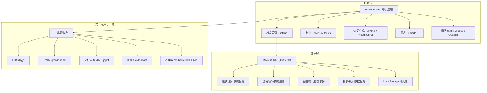

## 1. 架构设计



## 2. 技术说明
- **前端框架**: React 18 + TypeScript 5，使用 Vite 5 作为构建工具
- **样式方案**: TailwindCSS 3.4 + CSS Variables 主题系统，PostCSS 处理浏览器兼容
- **状态管理**: Zustand 轻量级状态管理，按业务域拆分 store（批次/仓储/召回/报表）
- **路由方案**: React Router v6，嵌套路由 + 布局路由，支持路由懒加载
- **UI 组件**: 基于 Headless UI 封装业务组件（表格、弹窗、表单、Stepper、Timeline）
- **图表可视化**: ECharts 5，封装 React Hook 按需加载，支持柱状图/折线图/饼图/地图
- **扫码识别**: html5-qrcode（摄像头扫码）+ 手动输入兜底
- **二维码生成**: qrcode.react 生成追溯码与标签
- **文件处理**: xlsx 导出 Excel 报表，jspdf + html2canvas 导出 PDF 合规报告
- **表单验证**: react-hook-form + zod 联合校验，支持复杂表单分步提交
- **Mock 数据**: 前端内置完善的 Mock 服务层，使用 faker.js 生成真实感模拟数据，LocalStorage 持久化用户操作

## 3. 路由定义
| 路由路径 | 页面名称 | 说明 |
|----------|----------|------|
| /dashboard | 批次看板 | 首页，数据总览 + 批次列表 + 预警 |
| /production | 生产记录 | 批次列表 + 新建/编辑批次 + 工序时间轴 |
| /production/new | 新建批次 | 多步骤表单 |
| /production/:id | 批次详情 | 原料 + 工序 + 检验详情 |
| /coding | 赋码贴标 | 码池 + 批量赋码 + 标签模板 + 打印中心 |
| /warehouse | 仓储流转 | 扫码入库/出库 + 签收确认 + 库存 + 效期 |
| /warehouse/in | 扫码入库 | 扫码界面 |
| /warehouse/out | 扫码出库 | 扫码界面 + 经销商选择 |
| /recall | 异常召回 | 异常工单 + 召回范围 + 批次冻结 + 窜货分析 |
| /query | 公众查询 | 消费者验真页面（独立简化布局） |
| /reports | 报表中心 | 多维度报表 + 合规导出 + 操作日志 |

## 4. 数据模型

### 4.1 数据模型定义 (ER 图)

```mermaid
erDiagram
    BATCH ||--o{ RAW_MATERIAL : uses
    BATCH ||--o{ PROCESS_STEP : has
    BATCH ||--|| QC_REPORT : has
    BATCH ||--o{ TRACE_CODE : generates
    BATCH ||--o{ WAREHOUSE_RECORD : relates
    BATCH ||--o{ RECALL_ORDER : involves
    
    TRACE_CODE ||--o{ WAREHOUSE_RECORD : tracks
    TRACE_CODE ||--o{ DEALER_SIGN : confirms
    TRACE_CODE ||--o{ STORE_ARRIVAL : delivers
    TRACE_CODE ||--o{ CONSUMER_VERIFY : verified_by
    
    DEALER ||--o{ DEALER_SIGN : signs
    STORE ||--o{ STORE_ARRIVAL : confirms
    
    RECALL_ORDER ||--o{ RECALL_PROGRESS : tracks
    
    BATCH {
        string id PK "批次ID"
        string product_name "产品名称"
        string spec "规格"
        int planned_qty "计划产量"
        date production_date "生产日期"
        date expiry_date "有效期至"
        string status "状态: 在产/合格/入库/在途/已售/冻结"
        string工艺路线 "工艺路线"
        datetime created_at "创建时间"
    }
    
    RAW_MATERIAL {
        string id PK "原料ID"
        string batch_id FK "批次ID"
        string supplier "供应商"
        string material_batch "原料批号"
        string material_name "原料名称"
        date received_date "进厂日期"
        string qc_cert "质检合格证号"
    }
    
    PROCESS_STEP {
        string id PK "工序ID"
        string batch_id FK "批次ID"
        int step_order "工序序号"
        string step_name "工序名称"
        string operator "责任人"
        string equipment "设备编号"
        datetime start_time "开始时间"
        datetime end_time "结束时间"
        string params "工艺参数JSON"
        string status "待开始/进行中/已完成"
    }
    
    QC_REPORT {
        string id PK "质检ID"
        string batch_id FK "批次ID"
        string conclusion "检验结论: 合格/不合格/待检"
        string inspector "检验员"
        datetime inspect_date "检验日期"
        json items "检验项目明细"
        string[] attachments "附件URL"
    }
    
    TRACE_CODE {
        string id PK "追溯码ID"
        string code UK "追溯码"
        string batch_id FK "批次ID"
        string level "层级: 箱/盒/瓶"
        string parent_code "父级码"
        string status "未使用/已赋码/入库/出库/签收/已售/召回"
        string current_location "当前位置"
        datetime generated_at "生成时间"
    }
    
    WAREHOUSE_RECORD {
        string id PK "仓储记录ID"
        string batch_id FK "批次ID"
        string trace_code FK "追溯码"
        string type "入库/出库"
        string warehouse "仓库编号"
        string location "库位"
        string operator "操作员"
        int quantity "数量"
        string related_order "关联单号"
        string dealer_id "出库时经销商ID"
        datetime operate_time "操作时间"
    }
    
    DEALER {
        string id PK "经销商ID"
        string name "经销商名称"
        string region "所属区域"
        string contact "联系人"
        string phone "联系电话"
        string level "一级/二级/三级"
    }
    
    DEALER_SIGN {
        string id PK "签收ID"
        string trace_code FK "追溯码"
        string dealer_id FK "经销商ID"
        string signer "签收人"
        datetime sign_time "签收时间"
        string remark "备注"
    }
    
    STORE {
        string id PK "门店ID"
        string name "门店名称"
        string address "地址"
        string region "区域"
    }
    
    STORE_ARRIVAL {
        string id PK "到货ID"
        string trace_code FK "追溯码"
        string store_id FK "门店ID"
        string confirmer "确认人"
        datetime confirm_time "确认时间"
    }
    
    CONSUMER_VERIFY {
        string id PK "验真ID"
        string trace_code FK "追溯码"
        datetime verify_time "验真时间"
        string location "验真地域IP"
        int verify_count "第几次验真"
    }
    
    RECALL_ORDER {
        string id PK "召回ID"
        string title "召回标题"
        string reason "异常原因"
        string level "严重等级: 一般/重要/紧急"
        string[] affected_batches "涉事批次"
        string[] affected_regions "涉事区域"
        string status "调查中/召回中/已完成/已取消"
        string initiator "发起人"
        datetime created_at "发起时间"
    }
    
    RECALL_PROGRESS {
        string id PK "进度ID"
        string recall_id FK "召回ID"
        string stage "阶段: 通知/反馈/回收/销毁"
        string dealer_id "经销商ID"
        int total_qty "应回收数量"
        int received_qty "已回收数量"
        string status "待处理/处理中/已完成/异常"
        datetime deadline "截止时间"
    }
    
    OPERATION_LOG {
        string id PK "日志ID"
        string user_id "操作用户ID"
        string user_name "用户名"
        string role "角色"
        string action "操作动作"
        string module "所属模块"
        string target_id "操作对象ID"
        string ip "IP地址"
        json before_data "操作前数据"
        json after_data "操作后数据"
        datetime created_at "操作时间"
    }
```

## 5. 目录结构

```
src/
├── assets/                  # 静态资源
│   ├── fonts/               # 字体文件
│   ├── images/              # 图片
│   └── styles/              # 全局样式 tailwind entry
├── components/              # 全局公共组件
│   ├── layout/              # 布局组件 (Sidebar/Header/Breadcrumb)
│   ├── ui/                  # 基础 UI (Button/Input/Table/Modal/Drawer/Tabs/Card)
│   ├── charts/              # 图表组件 (LineChart/BarChart/PieChart/GeoMap)
│   ├── forms/               # 表单组件 (FormItem/DatePicker/Select/Upload)
│   └── business/            # 业务公共组件 (TraceTimeline/CodeScanner/StatusBadge)
├── pages/                   # 页面
│   ├── dashboard/           # 批次看板
│   ├── production/          # 生产记录
│   ├── coding/              # 赋码贴标
│   ├── warehouse/           # 仓储流转
│   ├── recall/              # 异常召回
│   ├── query/               # 公众查询
│   └── reports/             # 报表中心
├── stores/                  # Zustand stores
│   ├── batchStore.ts        # 批次/生产状态
│   ├── warehouseStore.ts    # 仓储状态
│   ├── recallStore.ts       # 召回状态
│   └── uiStore.ts           # UI 全局状态
├── services/                # Mock 数据服务
│   ├── mock/                # mock 数据生成器
│   ├── batchService.ts      # 批次 API
│   ├── warehouseService.ts  # 仓储 API
│   ├── recallService.ts     # 召回 API
│   ├── reportService.ts     # 报表 API
│   └── request.ts           # 统一请求封装 (mock 适配层)
├── hooks/                   # 自定义 Hooks
│   ├── useCountUp.ts        # 数字滚动动画
│   ├── useScanner.ts        # 扫码 Hook
│   ├── useExport.ts         # 导出 Hook
│   └── useBreadcrumb.ts     # 面包屑 Hook
├── types/                   # TypeScript 类型定义
│   ├── batch.ts             # 批次相关类型
│   ├── warehouse.ts         # 仓储相关类型
│   ├── recall.ts            # 召回相关类型
│   └── common.ts            # 通用类型
├── utils/                   # 工具函数
│   ├── date.ts              # 日期处理
│   ├── code.ts              # 追溯码生成器
│   ├── format.ts            # 格式化工具
│   └── storage.ts           # LocalStorage 封装
├── router/                  # 路由配置
│   └── index.tsx
├── App.tsx
└── main.tsx
```
