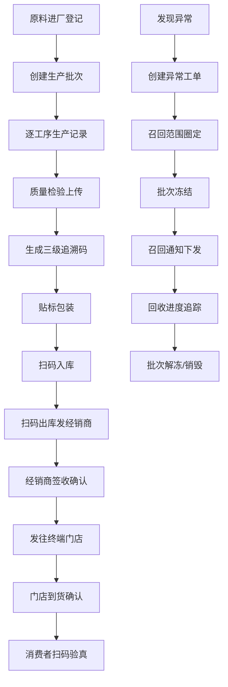

## 1. 产品概述
药品追溯 Web 应用是面向制药企业的全链路单品追溯管理平台，覆盖从原料采购、生产赋码、仓储流转到终端消费者验真的完整生命周期。系统为质检、仓储、售后及监管人员提供可视化管理界面，实现药品流向可查、责任可究、风险可控，满足 GMP/GSP 合规要求，提升供应链透明度与药品安全保障能力。

## 2. 核心功能

### 2.1 用户角色
| 角色 | 注册方式 | 核心权限 |
|------|----------|----------|
| 系统管理员 | 后台创建 | 全部功能，用户管理，系统配置 |
| 质检人员 | 管理员分配 | 批次管理、生产记录、检验结论上传、报表导出 |
| 仓储人员 | 管理员分配 | 赋码贴标、扫码入库/出库、库存管理、过期预警 |
| 售后人员 | 管理员分配 | 异常召回、批次冻结/解冻、窜货分析、合规报告 |
| 经销商/门店 | 自助申请+审核 | 签收确认、到货确认、库存查询 |
| 消费者 | 无需注册 | 扫码验真、追溯信息查询 |

### 2.2 功能模块
1. **批次看板**：批次总览、在产/在库/在途/已售统计、实时预警、快捷操作入口
2. **生产记录**：新建批次、原料来源登记、工序节点绑定、检验结论上传、生产进度追踪
3. **赋码贴标**：追溯码生成规则配置、批量赋码、标签模板管理、打印预览与批量打印
4. **仓储流转**：扫码入库、扫码出库、经销商签收、门店到货确认、库存实时查询、效期管理
5. **异常召回**：异常工单创建、召回范围圈定、批次冻结/解冻、召回进度追踪、窜货提示
6. **公众查询**：消费者扫码验真、追溯链路可视化展示、真伪鉴别、过期提示
7. **报表中心**：生产报表、库存报表、流通报表、召回报表、合规报告导出、操作日志审计

### 2.3 页面详情
| 页面名称 | 模块名称 | 功能描述 |
|----------|----------|----------|
| 批次看板 | 数据概览卡片 | 展示总批次数、在产批次、在库数量、预警条数等关键指标 |
| 批次看板 | 批次列表 | 分页展示所有批次，支持按状态、日期、产品筛选搜索 |
| 批次看板 | 预警通知区 | 滚动展示过期预警、窜货预警、召回预警等实时消息 |
| 批次看板 | 快捷操作区 | 新建批次、生成追溯码、扫码入库、发起召回等快捷入口 |
| 生产记录 | 批次新建表单 | 录入产品名称、规格、计划产量、生产日期、工艺路线等 |
| 生产记录 | 原料来源登记 | 关联供应商、原料批号、检验报告、入库凭证 |
| 生产记录 | 工序节点绑定 | 按生产流程绑定各工序责任人、设备、起止时间、参数记录 |
| 生产记录 | 检验结论上传 | 上传 QC 检验报告、微生物检测、稳定性试验等文件与结论 |
| 生产记录 | 生产进度时间轴 | 可视化展示各工序完成状态与当前所处节点 |
| 赋码贴标 | 码池管理 | 追溯码规则配置（前缀、编码规则、层级关联）、码池余量监控 |
| 赋码贴标 | 批量赋码 | 选择批次，按箱-盒-瓶三级层级生成并绑定追溯码 |
| 赋码贴标 | 标签模板 | 预设多种标签模板，支持自定义字段、Logo、二维码大小 |
| 赋码贴标 | 打印中心 | 单张打印、批量打印、打印记录、打印机管理 |
| 仓储流转 | 扫码入库 | 扫描箱码入库，自动关联批次、库位、入库时间、操作人员 |
| 仓储流转 | 扫码出库 | 扫描箱码出库，选择经销商、销售订单、发货方式 |
| 仓储流转 | 经销商签收 | 经销商确认收货，记录签收时间、签收人、异常备注 |
| 仓储流转 | 门店到货确认 | 终端门店确认到货，完成端到端流通闭环 |
| 仓储流转 | 库存查询 | 多维度库存查询（按批次、库位、效期、产品）、库存盘点 |
| 仓储流转 | 效期管理 | 近效期/过期药品列表、自动预警、库存周转分析 |
| 异常召回 | 异常工单 | 登记异常类型（质量问题、投诉、不良反应）、严重等级、涉及范围 |
| 异常召回 | 召回范围圈定 | 按批次/时间/地域/经销商圈定召回产品，生成召回清单 |
| 异常召回 | 批次冻结/解冻 | 一键冻结涉事批次，冻结后禁止出库，支持解冻操作 |
| 异常召回 | 召回进度追踪 | 召回通知下发、经销商反馈、产品回收、销毁记录全流程追踪 |
| 异常召回 | 窜货分析 | 流向异常检测、窜货地域热力图、嫌疑批次清单 |
| 公众查询 | 扫码验真 | 输入或扫描追溯码，展示产品基础信息与真伪状态 |
| 公众查询 | 追溯链路图 | 从原料→生产→仓储→经销商→门店的可视化链路 |
| 公众查询 | 质检报告 | 公开的质检结论与关键指标展示 |
| 公众查询 | 用药提示 | 用法用量、禁忌、储存条件、过期提醒 |
| 报表中心 | 生产报表 | 批次产量、合格率、工时统计、原料消耗分析 |
| 报表中心 | 库存报表 | 出入库明细、库存周转率、效期分布、库位利用率 |
| 报表中心 | 流通报表 | 经销商流向、销售分布、门店覆盖率、签收时效 |
| 报表中心 | 召回报表 | 异常统计、召回完成率、响应时效、整改追踪 |
| 报表中心 | 合规报告 | GMP/GSP 合规报告导出、审计追踪、一键生成监管上报文件 |
| 报表中心 | 操作日志 | 全系统操作留痕，支持按用户、时间、操作类型筛选查询 |

## 3. 核心流程
药品追溯核心流程覆盖从原料进厂到消费者验真的全链路。原料进厂时登记供应商与批次信息，生产过程中逐工序绑定责任节点，完成质检后生成三级追溯码（箱-盒-瓶）并贴标，产品入库扫码关联库位，出库时绑定经销商与订单，经销商和门店逐级签收确认，最终消费者扫码验证真伪与流向。异常情况可随时发起召回，圈定范围后冻结批次，追踪回收进度。

## 4. 用户界面设计

### 4.1 设计风格
- **主色调**：医疗科技蓝（#1E6FDB）为主色，搭配信任绿（#10B981）表示合格/正常，警示橙（#F59E0B）表示预警，危险红（#EF4444）表示异常/召回
- **辅助色**：中性灰阶（#F8FAFC / #E2E8F0 / #64748B）用于背景、边框、文字
- **按钮风格**：胶囊圆角按钮（圆角 12px），主按钮带渐变光晕效果，悬停时 0.2s 微上浮 + 阴影加深
- **字体选择**：标题使用 Noto Serif SC 衬线体体现专业可靠感，正文使用 Noto Sans SC 无衬线体保证可读性；数据展示使用 JetBrains Mono 等宽字体
- **布局风格**：左侧固定导航栏 + 顶部面包屑状态栏 + 主内容区卡片式布局，信息密度适中，留白充足
- **图标风格**：线性图标（stroke 1.5px）搭配柔和填充色，关键功能使用渐变图标增强视觉层级
- **整体调性**：专业医疗科技风，强调数据可信度与操作安全感，适度使用发光描边与玻璃拟态增强高级感

### 4.2 页面设计概览
| 页面名称 | 模块名称 | UI 元素 |
|----------|----------|---------|
| 批次看板 | 数据概览卡片 | 渐变背景卡片、动态数字计数、迷你趋势折线图、状态色标签 |
| 批次看板 | 批次列表 | 斑马纹表格、状态徽章、悬浮操作工具栏、行展开详情 |
| 批次看板 | 预警通知区 | 左侧图标 + 彩色左侧边框、滚动动画、可点击跳转详情 |
| 批次看板 | 快捷操作区 | 图标按钮组、悬停时背景发光、底部快捷键提示 |
| 生产记录 | 表单页 | 分步骤 Stepper 引导、分区折叠面板、必填项红星标注、实时校验提示 |
| 生产记录 | 时间轴 | 左侧竖线节点、完成打勾动画、当前节点脉冲高亮、悬停展开详情 |
| 赋码贴标 | 码池监控 | 进度环可视化、余量数字警示色、刷新按钮动画 |
| 赋码贴标 | 标签预览 | A4 纸张模拟、阴影投影、放大缩小控件、打印预览分隔线 |
| 仓储流转 | 扫码界面 | 大号扫描框动画、四角定位线、摄像头模拟区、扫码成功/失败状态反馈 |
| 仓储流转 | 库存热力图 | 库位网格 + 颜色深浅表示库存密度、点击下钻查看明细 |
| 异常召回 | 范围圈定 | 中国地图 + 省份高亮着色、批次筛选器组合、圈定统计数字 |
| 异常召回 | 召回进度 | 横向甘特图 + 百分比、节点状态图标、延迟项目红色高亮 |
| 公众查询 | 验真结果 | 大号真伪徽章（对勾/感叹号）、发光成功/失败效果、卡片式追溯信息 |
| 公众查询 | 追溯链路图 | 横向流程图 + 节点图标、连接线渐变、点击节点展开详情抽屉 |
| 报表中心 | 图表区 | ECharts 柱状图/折线图/饼图组合、图例可点击筛选、悬浮 Tooltip |
| 报表中心 | 操作日志 | 时间倒序列表、操作人头像/角色标签、差异高亮对比视图 |

### 4.3 响应式设计
- **设计原则**：Desktop-first，核心管理功能以 1440px 宽度为基准优化
- **断点策略**：≥1280px 完整三栏布局，1024-1280px 紧凑两栏，768-1024px 折叠侧栏为抽屉，<768px 移动端简化布局（公众查询页重点适配）
- **触控优化**：移动端按钮最小触控区 44x44px，表单输入框增大内边距，扫码页适配竖屏操作
- **打印适配**：标签打印页提供专门的 @media print 样式，去除无关 UI 元素

### 4.4 动效与微交互
- **页面入场**：各模块按 80ms 间隔依次淡入上移（stagger animation）
- **扫码反馈**：扫码成功时绿色对勾从中心扩散的涟漪动画，失败时红色抖动 + X 标记
- **数据刷新**：数字变化时滚动累加动画，进度条平滑过渡
- **批次冻结**：覆盖层从上往下滑落的冻结特效 + 雪花图标动画
- **导航切换**：选中菜单项的下划线左右滑动过渡，未选中项微妙失焦
